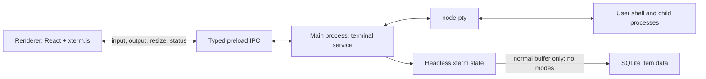

# Terminal items

Research updated: 2026-08-18

## Decision

Terminal is a first-class workspace item alongside chat. It uses the existing tree, folders,
tabs, drag-and-drop, split panes, title editing, and pane header. Its body is an interactive
terminal.

Use:

- `@xterm/xterm` 6.0.0 with `@xterm/addon-fit` 0.11.0 in the renderer.
- `@xterm/headless` 6.0.0 with `@xterm/addon-serialize` 0.14.0 in the main process.
- `node-pty` 1.2.0-beta.14 in the Electron main process.
- A single typed `items` table with `data`, `metadata`, and `extensions` JSON columns.
- One lazy in-memory PTY session per open terminal item.
- xterm-serialized terminal state for live reconnects and safe app-restart display history.

Do not use Ghostty yet. `libghostty-vt` is promising and usable from C, Zig, and Wasm, but its
API is still unversioned and changing, and it intentionally does not provide a renderer or
windowing layer. Hanoki would have to maintain bindings plus rendering, input, clipboard, IME,
accessibility, and packaging that xterm already provides. Revisit it after it has a versioned
embedding API and a maintained Electron/browser integration.

## Why Terminal belongs in Hanoki

Terminal makes Hanoki a local workbench instead of a chat window that repeatedly sends builders
to another app. A folder can hold the conversation, the shell used to test it, and future item
types as one durable project context. Chat and terminal can sit side by side using the split-pane
system Hanoki already has.

This is also a useful product probe. Creative and roleplay users lose nothing and do not need to
pay for developer machinery they never use; developers receive a concrete reason to adopt and
recommend Hanoki. There is no need to force a pricing decision into the first version. The small
native dependency and app-size increase are acceptable while the product direction is still
being discovered.

The feature should remain deliberately narrower than an IDE. It is a good foundation for future
explicit actions such as “send selection to chat” or “open a terminal in this project,” but the
first version is simply an excellent local terminal that lives wherever any other item can live.

## Data model

`items.type` is the discriminator. Common fields are columns; type-specific fields live in typed
JSON.

```text
items
  id, workspace_id, folder_id, type, title
  data, metadata, extensions
  created_at, updated_at

messages
  item_id -> items.id

assets
  item_id -> items.id
```

```ts
type ChatItem = {
  type: "chat";
  data: {
    settings: ChatSettings;
    currentBranchId?: string;
  };
};

type TerminalItem = {
  type: "terminal";
  data: {
    workingDirectory: string;
    shell: string;
    columns: number;
    rows: number;
    scrollback: string;
    scrollbackVersion: number;
  };
};
```

There are no parallel chat and terminal tree models and no type-specific item tables. Pane and
tab state store `itemId` and `itemType`; chat-only views stay inside the chat branch of the pane
union.

Terminal output persistence does not touch `items.updatedAt`. Otherwise every output chunk would
cause database churn and continuously reorder recency-based UI.

## Runtime architecture



The renderer receives only terminal-scoped methods and typed events through the context bridge;
it never receives Node APIs or a generic `ipcRenderer`. The main process validates that an ID is
a terminal item before spawning or controlling anything.

A session belongs to the item, not to a React component. Closing a pane or tab only detaches the
xterm view, so reopening it reconnects to the same live shell. Deleting the item stops the PTY.

One service in the main process is enough for the first version. A utility process, MessagePorts,
and flow-control protocol would add a second lifecycle and substantially more code before actual
output volume demonstrates that isolation is needed.

## Persistence contract

| Event                          | Restored state                                                      |
| ------------------------------ | ------------------------------------------------------------------- |
| Pane closes, Hanoki stays open | Same live process, cwd, environment, jobs, and output               |
| Pane reopens                   | Snapshot plus sequenced output emitted during attachment            |
| Shell exits                    | Item and output remain                                              |
| Hanoki restarts                | Bounded visible history, cwd, shell, and size; a fresh shell starts |
| Item is deleted                | PTY is terminated and persisted item data is removed                |

Exact process resurrection after Hanoki exits is not promised. A process's memory, file
descriptors, jobs, SSH connection, and TUI state cannot be serialized into SQLite. Keeping them
alive across application exit would require an external daemon or multiplexer such as tmux and a
different product/lifecycle commitment.

The main process mirrors PTY output into `@xterm/headless`, using the same dimensions and bounded
10,000-line scrollback as the renderer. A live reconnect serializes the complete state, including
the active alternate buffer and interaction modes, because the original process is still alive.
Before an app restart, `@xterm/addon-serialize` serializes only the normal buffer with
`excludeAltBuffer` and `excludeModes`. The fresh shell therefore receives visible history without
inheriting mouse tracking, focus reporting, bracketed paste, or another program's alternate
screen. This is the same normal-buffer-only pattern used by VS Code's persistent terminal service.

Headless writes are asynchronous. Snapshot and shutdown paths wait until xterm has parsed all
queued PTY output before serializing or closing SQLite. On restart Hanoki inserts a visible
new-session separator before fresh shell output. The persisted working directory is the
terminal's configured start directory; automatic cwd tracking can be added later with shell
integration.

xterm can emit terminal protocol replies through `onData` while parsing output, not only when a
user types. Snapshot replay therefore keeps PTY input disconnected until the serialized state is
fully parsed. Live output is connected immediately afterward, preserving normal capability-query
behavior for TUIs. The scrollback format is versioned so raw snapshots created before normal-buffer
serialization are discarded once instead of restoring stale interaction modes.

## Library and compatibility findings

`xterm.js` is the practical renderer because it is a mature browser terminal and is already used
with Electron and `node-pty`. Start with its DOM renderer and fit addon. WebGL, links, search, and
more terminal protocols can be added when demanded instead of widening the initial dependency
and lifecycle surface.

`node-pty` supplies real pseudoterminal semantics on macOS, Linux, and Windows ConPTY. Version
1.2.0-beta.14 is pinned because the current stable 1.1.0 has an open macOS pnpm packaging defect
where `spawn-helper` can lose its executable bit. The current beta contains that fix and is also
used by the repository's maintained Electron example.

Two active upstream issues require explicit build handling:

- xterm 6's pre-minified ESM can break DCS-using TUI programs when esbuild downlevels and
  re-minifies its mode-query parser. The renderer targets ES2021 so logical assignment is retained,
  which is the upstream issue's current dependency-free workaround.
- Electron Forge's Vite plugin currently copies only `.vite` and omits external native modules,
  despite the native-module documentation. Packaging uses a narrow ignore rule that keeps only
  `.vite`, `node-pty`, and its build-time `node-addon-api` dependency. The native module is then
  rebuilt for Electron and unpacked from ASAR.

The packaged macOS build was verified to contain an executable `spawn-helper`, an arm64 native
binding, a valid app signature, and a PTY that can spawn a shell and return output.

## Security and operational boundaries

- The terminal runs with the same OS permissions as Hanoki and the signed-in user. This is
  intentional and should be clear in the UI.
- Terminal input is never exposed as an automatic AI tool. Hanoki's approved AI command tool
  remains a separate trust boundary.
- Clipboard paste is an explicit user action. Future drag/drop paste must account for control
  characters before it is added.
- Scrollback is bounded in both xterm and persisted item data.
- No output chunk updates item recency.
- All PTYs are stopped during app shutdown; no hidden background daemon remains.

## Deferred scope

- Exact process persistence across application exit
- SSH/profile management
- Automatic shell-integration cwd and command tracking
- Terminal-specific splits in addition to Hanoki's item splits
- WebGL rendering and image protocols
- Search, links, command blocks, and shared sessions
- AI control of the interactive terminal

## Sources

- [xterm.js Terminal API](https://xtermjs.org/docs/api/terminal/classes/terminal/)
- [node-pty project and platform support](https://github.com/microsoft/node-pty)
- [node-pty Electron example](https://github.com/microsoft/node-pty/tree/main/examples/electron)
- [node-pty beta releases](https://github.com/microsoft/node-pty/releases)
- [node-pty pnpm `spawn-helper` issue](https://github.com/microsoft/node-pty/issues/919)
- [xterm 6 + Vite minification issue](https://github.com/xtermjs/xterm.js/issues/5800)
- [xterm serialize state limitations and normal-buffer restart discussion](https://github.com/xtermjs/xterm.js/issues/3093)
- [VS Code persistent terminal normal-buffer serialization](https://github.com/microsoft/vscode/blob/main/src/vs/platform/terminal/node/ptyService.ts)
- [Electron IPC guidance](https://www.electronjs.org/docs/latest/tutorial/ipc)
- [Electron context bridge](https://www.electronjs.org/docs/latest/api/context-bridge/)
- [Electron Forge Vite native-module guidance](https://www.electronforge.io/config/plugins/vite#native-node-modules)
- [Electron Forge incomplete ASAR issue](https://github.com/electron/forge/issues/3738)
- [Ghostty roadmap and libghostty status](https://github.com/ghostty-org/ghostty#cross-platform-libghostty-for-embeddable-terminals)
- [Ghostling renderer responsibilities](https://github.com/ghostty-org/ghostling)
